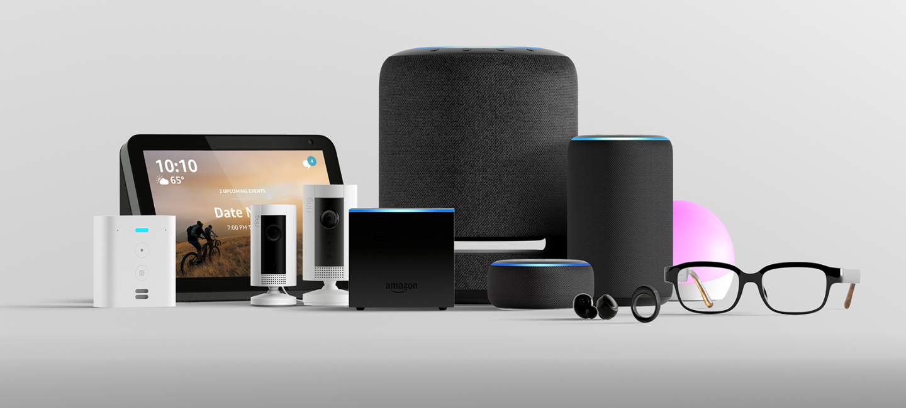
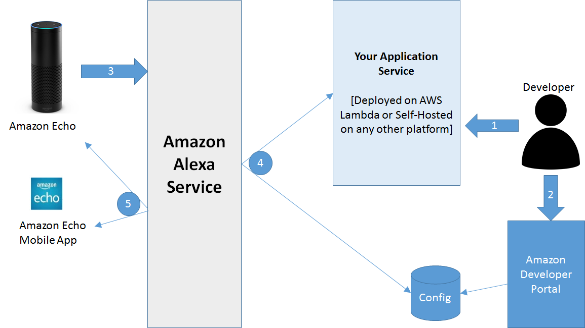

class: center, middle, background

# Building Your First Voice Experience
.center[]

.img-circle[]

### @ardenstone
### Jan, 15, 2020

---
class: center
## Agenda

### What is Alexa?
--

### The Alexa Skills Kit
--

### Best Pratices
--

### Demo

---
## What is Alexa?
.full[]

---
## What is Alexa?
.full[]

---
class: center, middle, background

## The Alexa Skills Kit
https://developer.amazon.com/alexa
---
## Demo: Tools needed
--

Visual Studio Code

https://code.visualstudio.com/

NodeJS

https://nodejs.org/en/

Alexa Developer Console

https://developer.amazon.com/alexa

Alexa Skill Kit CLI

```shell
npm install -g ask-cli
```

Recommended: Node Version Manager

https://github.com/nvm-sh/nvm

---
class: center, middle, background
# Best Pratices 

---
class: center, middle, background
# Questions